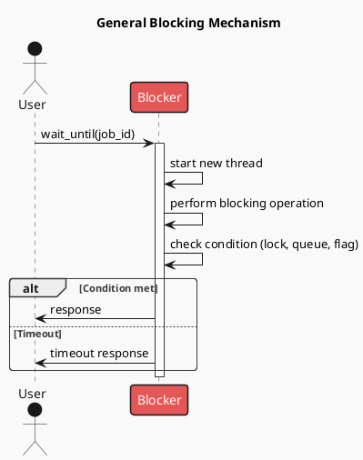
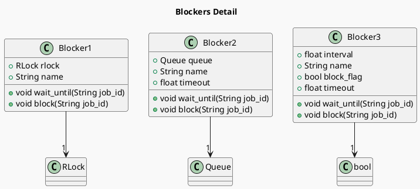

# 使用Queue的Python阻塞器

程序设计的核心不在键盘上，而在需求里。
本文就是针对这样一系列常见需求：

1. 程序执行严重依赖其他功能是否就位。
2. 程序间的通信遵循异步设计，其他功能的就位状态和等待时间完全随机。
3. 但其他功能就位后，程序要以尽量小的延时立即恢复工作。
4. 如果其他功能在`timeout`后仍然无效，那么需要忽略它并降级运行。

针对这些需求，我需要设计开销尽量小，延时尽量小的阻塞器。
我分别尝试了使用线程和同步机制在`Python`中实现的三种不同的阻塞方法。
实际测试中发现，使用`Queue`的阻塞器方法最为耐用。

[toc]

## 阻塞工作原理

阻塞是一种同步访问共享资源或确保在继续之前满足某些条件的机制。以下是阻塞工作原理的一般概述：

1. **启动阻塞**：调用 `wait_until` 方法并传入作业 ID。该方法启动一个新线程来执行阻塞操作。
2. **执行阻塞操作**：新线程执行一些耗时的工作或等待满足某个条件（例如，获取锁、等待队列项或检查标志）。
3. **检查条件**：阻塞操作检查条件（锁、队列、标志）以确定是否可以继续。
4. **响应**：如果在指定的超时时间内满足条件，则发送响应。如果在满足条件之前发生超时，则发送超时响应。

以下 PlantUML 图表展示了阻塞机制的总体工作原理：

## 阻塞方法比较

| 阻塞方法 | 低延迟 | 超时支持 | 方法  |
| -------- | ------ | -------- | ----- |
| Blocker1 | 是     | 否       | RLock |
| Blocker2 | 是     | 是       | Queue |
| Blocker3 | 否     | 是       | Flag  |

### Blocker1：通过 RLock 阻塞

此方法使用可重入锁（`RLock`）来同步访问共享资源。`wait_until` 方法启动一个新线程来执行阻塞操作，同时尝试获取锁。`block` 方法立即执行一些耗时的工作，期间获取锁。在`block`方法释放锁之后，原线程获取锁，并将作业详情添加到 `blocker_jobs` 列表中。

**注意**：Blocker1 在释放阻塞时有低时间延迟，因为锁状态旋转的开销是很小的。

### Blocker2：通过 Queue 阻塞

此方法使用 `Queue` 来管理阻塞。`wait_until` 方法启动`block`线程来执行阻塞操作，然后等待队列中被添加的项。如果在指定的超时时间内队列未更新，则记录错误。`block` 线程执行一些耗时的工作，然后向队列中添加主线程等待的项。

**注意**：Blocker2 在释放阻塞时有低时间延迟，并允许设置超时。并且传递的项可以用来表示`block`线程的运行结果，这是我目前比较推荐的方法。

### Blocker3：通过 Bool 标志阻塞

此方法使用布尔标志来管理阻塞。`wait_until` 方法启动一个新线程来执行阻塞操作，然后反复检查标志，直到标志被清除或发生超时。`block` 方法设置标志，执行一些耗时的工作，然后清除标志。

**注意**：Blocker3 允许设置超时。但该方法在反复检查标志时需要定时启动并消耗额外的计算资源，由于定时间隔设置不宜过小，因此该方法必然附带较大的延时。

## 用法

`blockers.py` 文件包含了相应代码，其中创建了每个阻塞器类的实例，并用于执行阻塞操作。结果使用 pandas DataFrames 显示。

## 变量设计表

以下 PlantUML 图表展示了阻塞器的详细信息：

