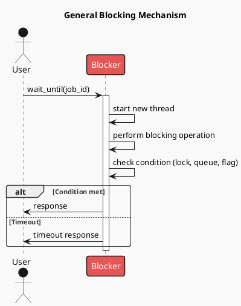
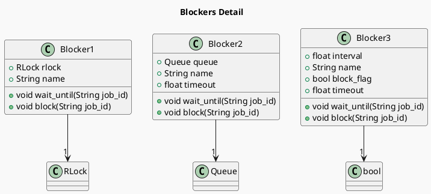

# Python Blockers using Queue

The core of program design is not on the keyboard, but in the requirements.
This article addresses a series of common requirements:

1. The program execution heavily depends on whether other functions are in place.
2. The interaction between functions follows an asynchronous design, and the readiness state and waiting time of other functions are completely random.
3. However, once other functions are in place, the program should resume work immediately with minimal delay.
4. If other functions are still invalid after the `timeout`, they need to be ignored and run in a degraded mode.

To meet these requirements, I need to design blockers with minimal overhead and delay.
I tried three different blocking methods implemented in `Python` using threading and synchronization mechanisms.
In actual tests, the blocking method using `Queue` proved to be the most durable.

This project demonstrates three different methods for blocking in Python using threading and synchronization mechanisms. The methods are implemented in the `blockers.py` file.

[toc]

## Blocking how-to-work

Blocking is a mechanism to synchronize access to shared resources or to ensure that certain conditions are met before proceeding. Here is a general overview of how blocking works:

1. **Initiate Blocking**: The `wait_until` method is called with a job ID. This method starts a new thread to perform the blocking operation.
2. **Perform Blocking Operation**: The new thread performs some time-consuming work or waits for a condition to be met (e.g., acquiring a lock, waiting for a queue item, or checking a flag).
3. **Check Condition**: The blocking operation checks the condition (lock, queue, flag) to determine if it can proceed.
4. **Respond**: If the condition is met within the specified timeout, a response is sent back. If the timeout occurs before the condition is met, a timeout response is sent.

The following PlantUML diagram visualizes the general blocking mechanism:

## Blocking Methods Comparison

| Blocking method | Low delay | Timeout support | Method |
| --------------- | --------- | --------------- | ------ |
| Blocker1        | Yes       | No              | RLock  |
| Blocker2        | Yes       | Yes             | Queue  |
| Blocker3        | No        | Yes             | Flag   |

### Blocker1: Blocking by RLock

This method uses a reentrant lock (`RLock`) to synchronize access to shared resources. The `wait_until` method starts a new thread to perform the blocking operation and then acquires the lock. The `block` method also acquires the lock, performs some time-consuming work, and then appends the job details to the `blocker_jobs` list.

**Note:** Blocker1 provides low time delay on block releasing.

### Blocker2: Blocking by Queue

This method uses a `Queue` to manage blocking. The `wait_until` method starts a new thread to perform the blocking operation and then waits for an item to be added to the queue. If the queue is not updated within the specified timeout, an error is recorded. The `block` method performs some time-consuming work and then adds an item to the queue.

**Note:** Blocker2 provides low time delay on block releasing and allows setting up a timeout.

### Blocker3: Blocking by Bool Flag

This method uses a boolean flag to manage blocking. The `wait_until` method starts a new thread to perform the blocking operation and then repeatedly checks the flag until it is cleared or a timeout occurs. The `block` method sets the flag, performs some time-consuming work, and then clears the flag.

**Note:** Blocker3 allows setting up a timeout.

## Usage

The `blockers.py` file includes a playground section where instances of each blocker class are created and used to perform blocking operations. The results are displayed using pandas DataFrames.

## Diagram

The following PlantUML diagram visualizes the details of the blockers:

